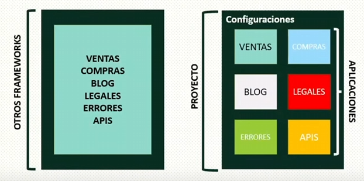

# Django



Django utiliza el patron de diseño Model-Template-View

## Configuración 

Python utiliza un archivo `requirements.txt` para especificar los paquetes y su versión, por ejemplo

```
django==5.1.7
```

y se instala con

```
pip install -r ./requirements.txt
```

Para comenzar un proyecto de Django corremos

```
django-admin startproject <Name>
```

Se crearán una carpeta con el nombre y un `manage.py`

Para ejecutarlo se ejecuta

```
cd <Name>
py ./manage.py runserver
```

El servidor se monta en `localhost:8000`

Para comenzar una aplicación se ejecuta

```
py ./manage.py startapp <AppName>
```

Para aplicar una migración se ejecuta

```
py ./manage.py migrate
```

Si se hacen cambiós en la base de datos, antes se tiene que correr

```
py ./manage.py makemigration
```


### setting.py

```python
DEBUG = True

ALLOWED_HOSTS = []
```

Ayuda a probar el proyecto. Si `DEBUG` es `False`, se debe especificar un host.

```python
STATIC_URL = 'static/'
```

Indica dónde se almacenan los archivos estáticos

```python
DEFAULT_AUTO_FIELD = 'django.db.models.BigAutoField'
```

Tipo por defecto de los campos de primary key

Todas nuestras apps se deben registrar en `INSTALLED_APPS`

```python
INSTALLED_APPS = [
    'django.contrib.admin',
    'django.contrib.auth',
    'django.contrib.contenttypes',
    'django.contrib.sessions',
    'django.contrib.messages',
    'django.contrib.staticfiles',
    # Apps propias
    'App1.apps.App1Config'
]
```

## Vistas

- Vistas Basadas en Clases
- Vistas Basadas en Funciones (Más utilizadas)

Las vistas se crean en `<AppName> views.py`, por ejemplo una vista de función sería

```python
def IndexView(request):
    '''Esto es la página principal'''

    objeto = AutorModel.objects.all().order_by("id")

    return render(request, "index.html", {"objeto":objeto})


def AutorView(request, id):
    autor = get_object_or_404(AutorModel, id=id)
    return render(request, "autor.html", {"objeto": autor})
```

## urls.py

Archivo donde se asocian vistas a una dirección

```python
urlpatterns = [
    path('', IndexView),
    path('autor/<int:id>', AutorView)
]
```

```python
urlpatterns = [
    path('admin/', admin.site.urls),
    path('', include("App1.urls"))
]
```

## Templates

En la aplicación creamos un directorio `templates`. En esta podemos guardar archivos de jinja2

Para renderizarlo, en `views.py` utilizamos `render`.

Para cargar los archivos estáticos se tiene que agregar `load static`
## Models

En `models.py` definimos nuestros modelos y utilizamos el ORM que viene dentro de Django para generar las tablas. Por ejemplo,
```python
class Profesion(models.Model):
    nombre = models.CharField(max_length=64, verbose_name="Nombre")

    def __str__(self):
        return self.nombre

        
class AutorModel(models.Model):
    nombre = models.CharField(max_length=255, verbose_name="Nombre")
    fecha_nacimiento = models.DateField(verbose_name="Fecha Nacimiento", null=False, blank=False)
    fecha_fallecimiento = models.DateField(verbose_name="Fecha Fallecimiento", null=True, blank=True)
    profesion = models.ManyToManyField(Profesion, verbose_name="Profesion")
    nacionalidad = models.CharField(verbose_name="Nacionalidad", max_length=64)

    class Meta:
        db_table = "Autores"
        verbose_name = "Autor"
        verbose_name_plural = "Autores"

    def __str__(self) -> str:
        return self.nombre


class FraseModel(models.Model):
    cita = models.TextField(verbose_name="Cita", max_length=500)
    autor_fx = models.ForeignKey(AutorModel, on_delete=models.CASCADE)

    class Meta:
        verbose_name = "Frase"
        verbose_name_plural = "Frases"
```

`verbose_name` es utilizado por el Administrador

## Administrador
